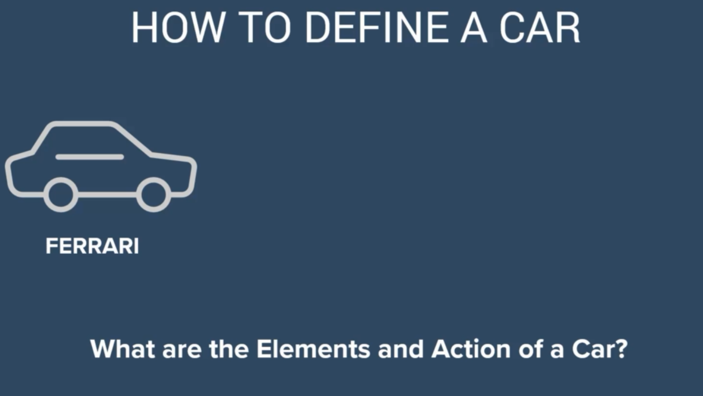
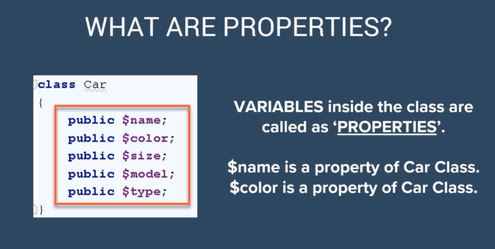
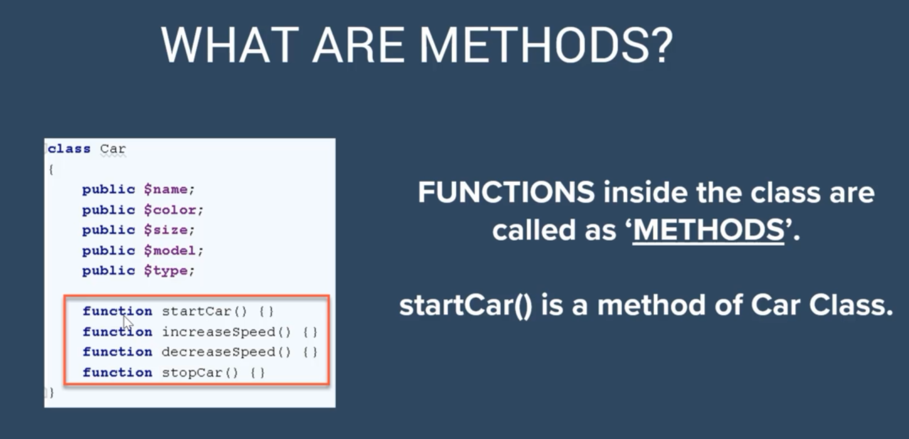
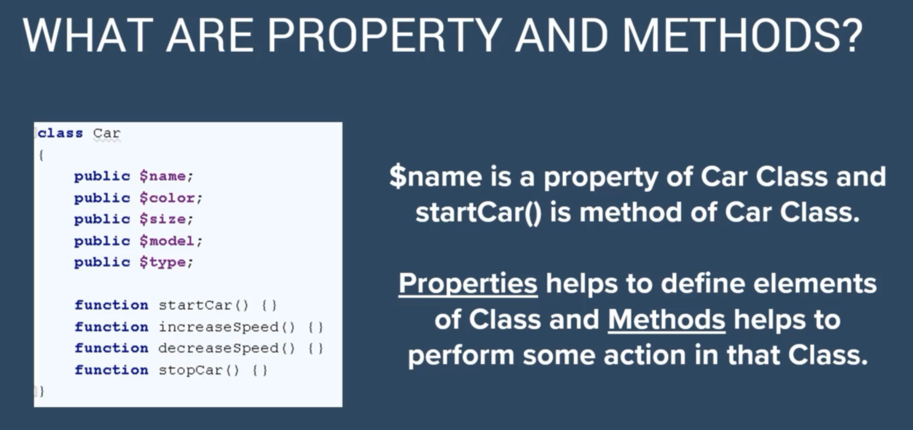
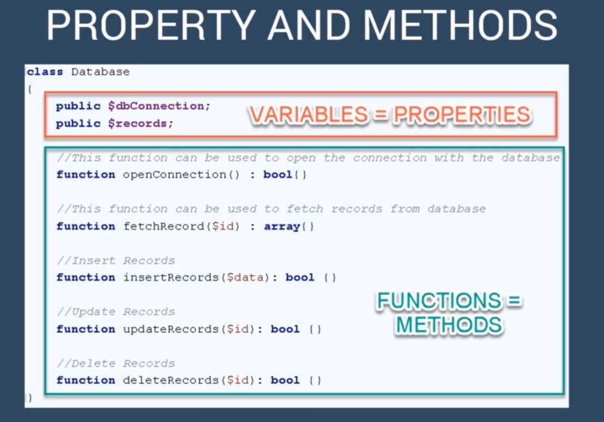

# What is Property And method








```php
<?php

class HelloClass {
//    this is a property
    public $content;
//    this is a method
    public function hello(){
        echo "Hello from The Hello()";
    }
}

```

