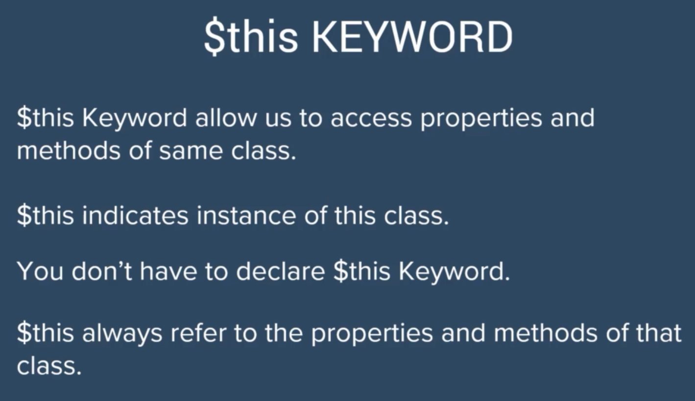
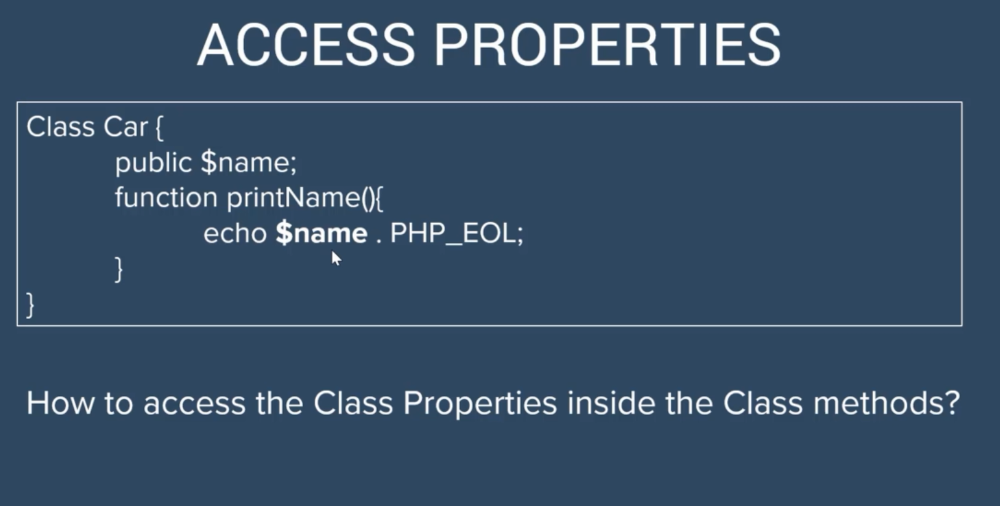
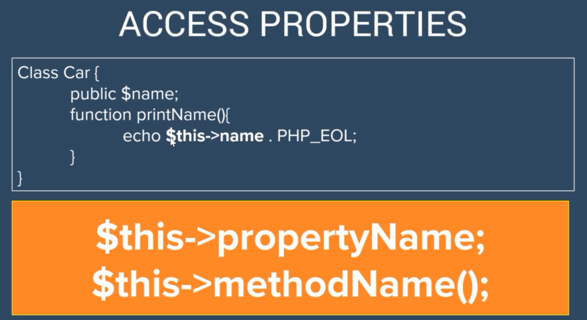
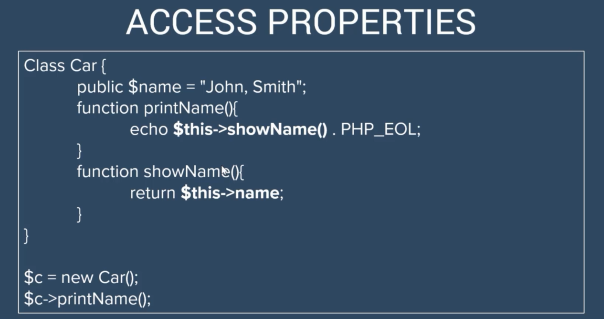

# **THIS** key word






## Code Example

```php
<?php
class Car{
    public $name ;
    public $age;

    /**
     * @return mixed
     */
    public function getName()
    {
        return $this->name;
    }

    /**
     * @param mixed $name
     */
    public function setName($name): void
    {
        $this->name = $name;
    }

    /**
     * @return mixed
     */
    public function getAge()
    {
        return $this->age;
    }

    /**
     * @param mixed $age
     */
    public function setAge($age): void
    {
        $this->age = $age;
    }


}

$newCar = new Car();
$newCar->setName("BMW");
$name = $newCar->getName();

echo "My Next Car Name:$name";
```
