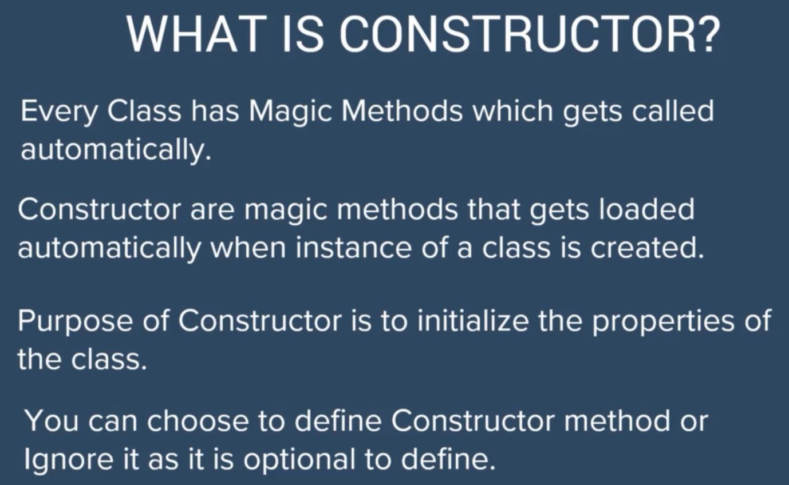
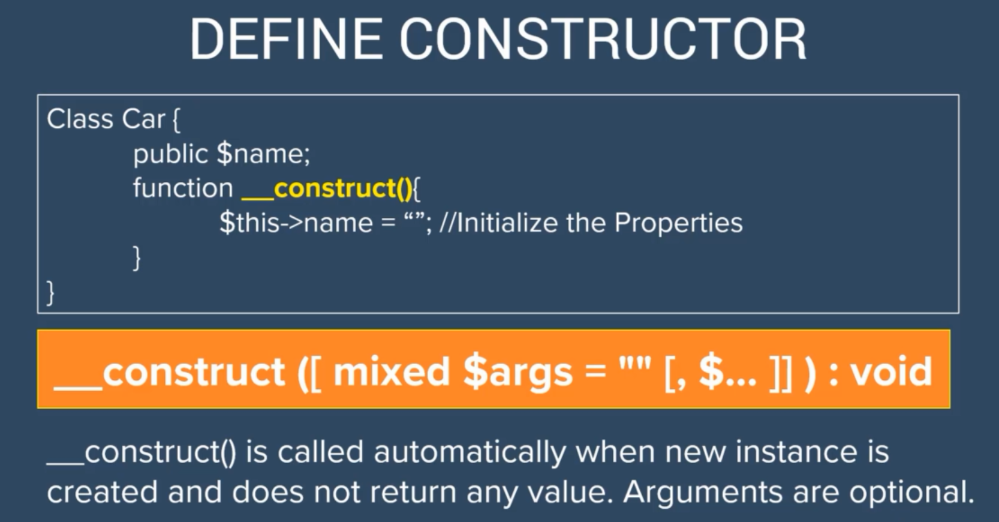
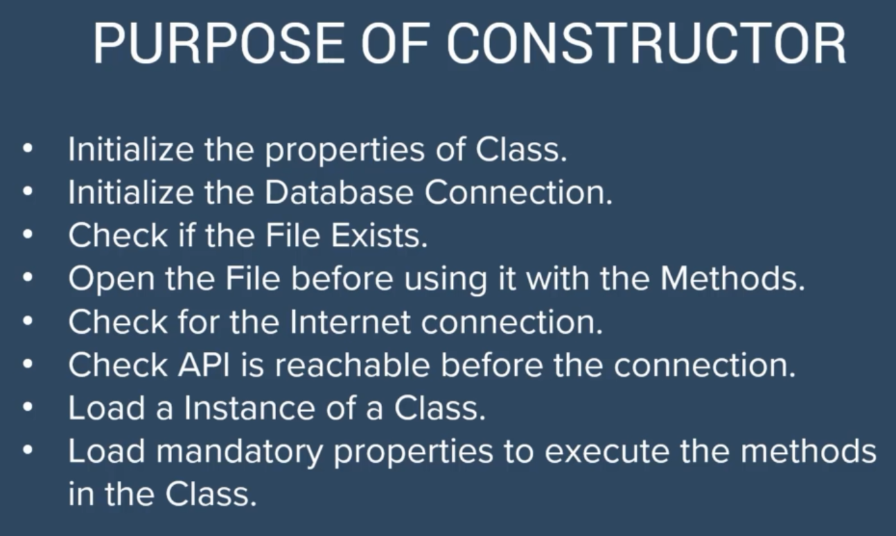

# Constructor and DeConstructor

## 

## 

## 

```php
<?php

class Student
{
    public string $name = "chamara";
    public int $age = 2;

    function __construct()
    {
        $this->name = "";
        $this->age = 0;
    }

    public function printData()
    {
        echo "this is a $this->age,Name:$this->name";
    }
}

$student = new Student();

$student->printData();

```

## Constructor with parameters

```php
<?php

class Student
{
    public string $name = "chamara";
    public int $age = 2;

    function __construct($name = "", $age = "")
    {
        $this->name = $name;
        $this->age = $age;
    }

    public function printData()
    {
        echo "this is a $this->age,Name:$this->name";
    }
}

$student = new Student("chamara",12);

$student->printData();
```

## code example

```php
<?php

class Employee
{
    public string $name;
    public string $id;
    public int $totalLeavestaken;
    public int $totalWorkingDays;
    public int $PerHourSalary = 15;
    public int $NoOfHoursWorking = 9;

    /**
     * Employee constructor.
     * @param string $name
     * @param string $id
     * @param int $totalLeavestaken
     */
    public function __construct(string $name, string $id, int $totalLeavestaken)
    {
        $this->name = $name;
        $this->id = $id;
        $this->totalLeavestaken = $totalLeavestaken;
    }


    public function CalTheSalary($totalDays)
    {
        $this->totalWorkingDays = $totalDays - $this->totalLeavestaken;
        return $this->totalWorkingDays * $this->PerHourSalary * $this->NoOfHoursWorking;
    }

}

$employee_one = new Employee("Chamara", "sdjfgsjfg121212", 3);


$salary = $employee_one->CalTheSalary(31);

echo "$employee_one->name with $employee_one->id has a salary of $salary";

```

## code example

```php
<?php

class Excercise
{

    public $fileHandler;
    public string $fileName;
    public $fileSize;
    public string $content;
    public bool $fileFound;


    public function __construct($file_name)
    {
        $this->fileHandler = null;
        $this->fileFound = false;
// check weather a file exists
        if (file_exists($file_name)) {
//            check weather it is a file
            if (is_file($file_name)) {
                $this->fileFound = true;
            }
        }
        if ($this->fileFound) {
            $this->fileHandler = fopen($file_name, 'r');
            $this->fileSize = filesize($file_name);
        }
    }

    function getConetnt()
    {
        if ($this->fileFound) {
            $this->content = fread($this->fileHandler, $this->fileSize);
            return $this->content;
        } else {
            return "No File Found";
        }
    }

    public function __destruct()
    {
        if ($this->fileFound) {
            fclose($this->fileHandler);
            echo "File is closed from Destructure";
        }
    }

}

$newFile = new Excercise('test.txt');
echo $newFile->get
```
