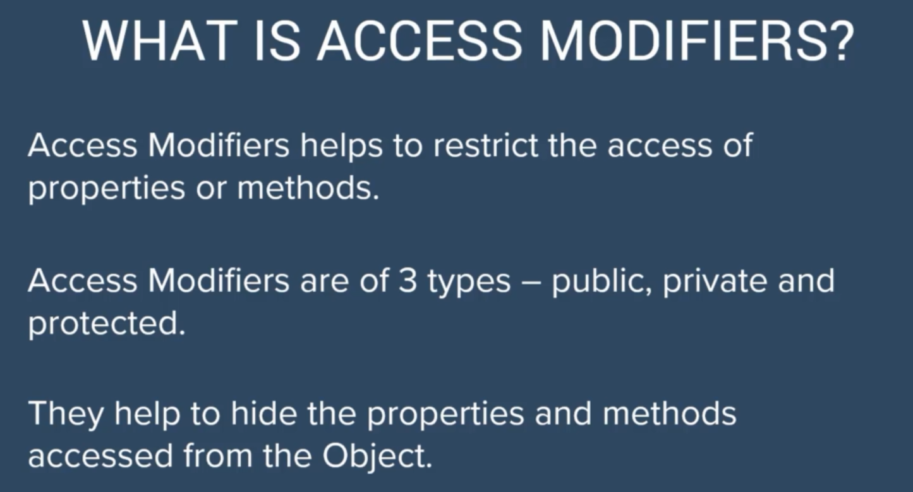
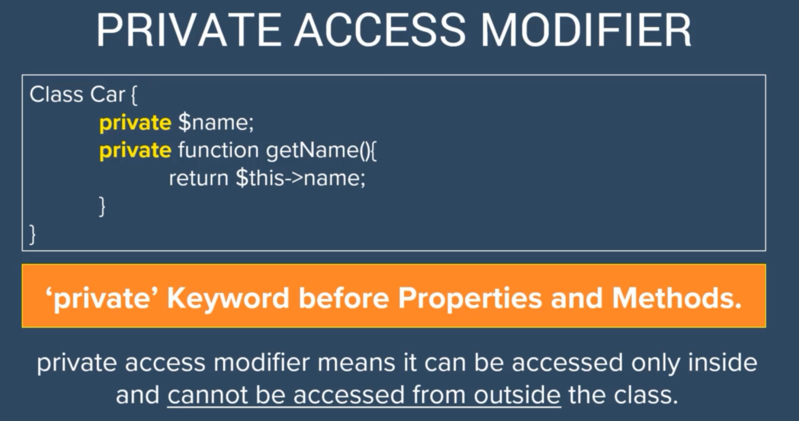

# Access modifiers



## Public

```php
<?php

class AccessModifiers
{
    public string $color;
    public string $breed;

    public function dogBark()
    {
        echo "Woof Woof" . PHP_EOL;
    }

    public function dogSleep()
    {
        echo "ZZZZZZZZZZZZZZZzzzzzzzzzz" . PHP_EOL;
    }

}


$newDog = new AccessModifiers();

$newDog->color = "black";
$newDog->breed = "black Shepard";

$newDog->dogBark();
$newDog->dogSleep();
```



## Private

```php
<?php

class AccessModifiers
{
    private string $color;
    private string $breed;

    /**
     * @return string
     */
    public function getColor(): string
    {
        return $this->color;
    }

    /**
     * @param string $color
     */
    public function setColor(string $color): void
    {
        $this->color = $color;
    }

    /**
     * @return string
     */
    public function getBreed(): string
    {
        return $this->breed;
    }

    /**
     * @param string $breed
     */
    public function setBreed(string $breed): void
    {
        $this->breed = $breed;
    }

    public function dogBark()
    {
        echo "Woof Woof" . PHP_EOL;
    }

    public function dogSleep()
    {
        echo "ZZZZZZZZZZZZZZZzzzzzzzzzz" . PHP_EOL;
    }

}


$newDog = new AccessModifiers();

$newDog->setColor("black")  ;
$newDog->setBreed("black Shepard")  ;

$newDog->dogBark();
$newDog->dogSleep();


```

## Comparison


