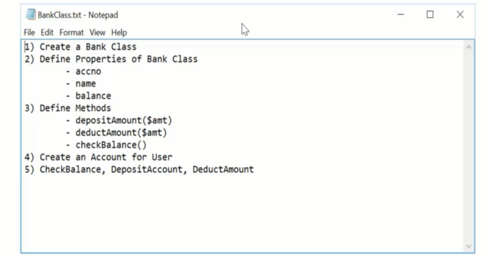
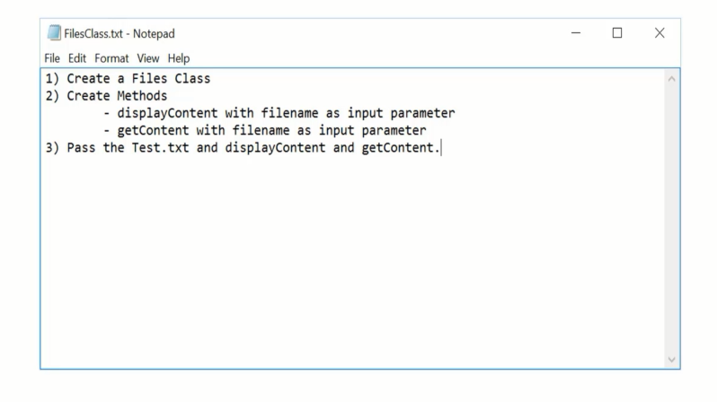

## Answer

```php
<?php

class Bank
{
    public string $name;
    public int $accountNumber;
    public float $balance;

    /**
     * @return float
     */
    public function getBalance(): float
    {
        return $this->balance;
    }

    /**
     * @param $amount
     * @return void
     */
    public function depositAmount($amount)
    {
        $this->balance += $amount;
    }

    /**
     * @param $amount
     * @return void
     */
    public function deducAmount($amount)
    {
        $this->balance -= $amount;
    }
}

$user = new Bank();
$user->name = "chamara";
$user->accountNumber = 12231;
$user->balance = 1000;

$user->depositAmount(2000);
echo "Balance:$user->balance" . PHP_EOL;
$user->deducAmount(200);
echo "Balance:$user->balance" . PHP_EOL;
$balace = $user->getBalance();
echo "Balance:$balace";

```



```php
<?php

/**
 * Class Files
 */
class Files
{
    public string $fileContent;

    public function readFiles(string $fileName): void
    {
        try {
            $this->fileContent = file_get_contents($fileName);
        } catch (Exception $exception) {
            echo "exception->getMessage()";
            echo $exception->getMessage() . PHP_EOL;
            echo "exception->getFile()";
            echo $exception->getFile() . PHP_EOL;
            echo "exception->getLine()";
            echo $exception->getLine() . PHP_EOL;
        }
    }

    public function getFileContent()
    {
        echo $this->fileContent;
    }
}

$file = new Files();
$file->readFiles("test.txt");
$file->getFileContent();
```

## output

```php
ksdbksdvb slvb sldv lsvlsfl ;sd v
ksdbksdvb slvb sldv lsvlsfl ;sd v
ksdbksdvb slvb sldv lsvlsfl ;sd v
ksdbksdvb slvb sldv lsvlsfl ;sd v
ksdbksdvb slvb sldv lsvlsfl ;sd v
ksdbksdvb slvb sldv lsvlsfl ;sd v
ksdbksdvb slvb sldv lsvlsfl ;sd v
ksdbksdvb slvb sldv lsvlsfl ;sd v
ksdbksdvb slvb sldv lsvlsfl ;sd v
ksdbksdvb slvb sldv lsvlsfl ;sd v
ksdbksdvb slvb sldv lsvlsfl ;sd v
ksdbksdvb slvb sldv lsvlsfl ;sd v
```
