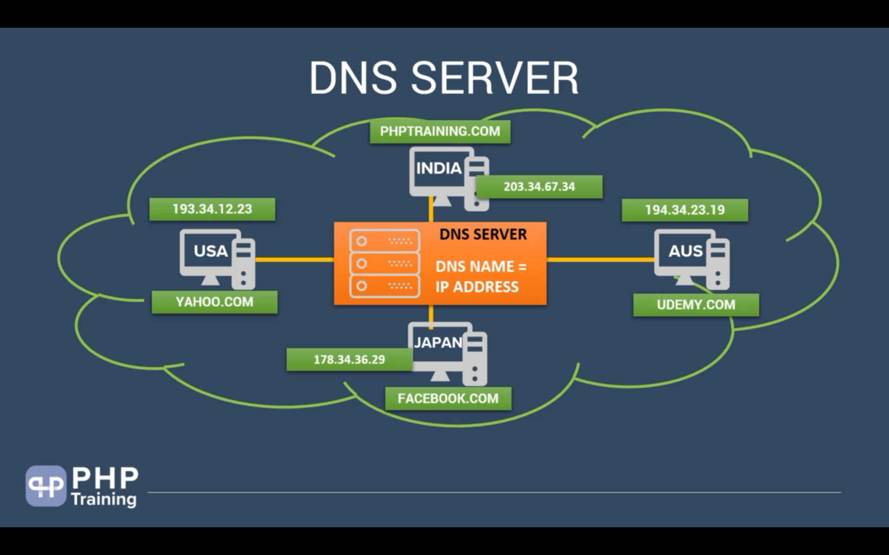

# Web Basics

## What is the challenge

---

## What is Protocol

## What is Internet

## What is TCP IP Protocol

## What is DNS

## What is HTTP

## How HTTP Works

## What is Client Server Technology

## How Website Works

## Types of Languages

## Compiler vs Interpreter

