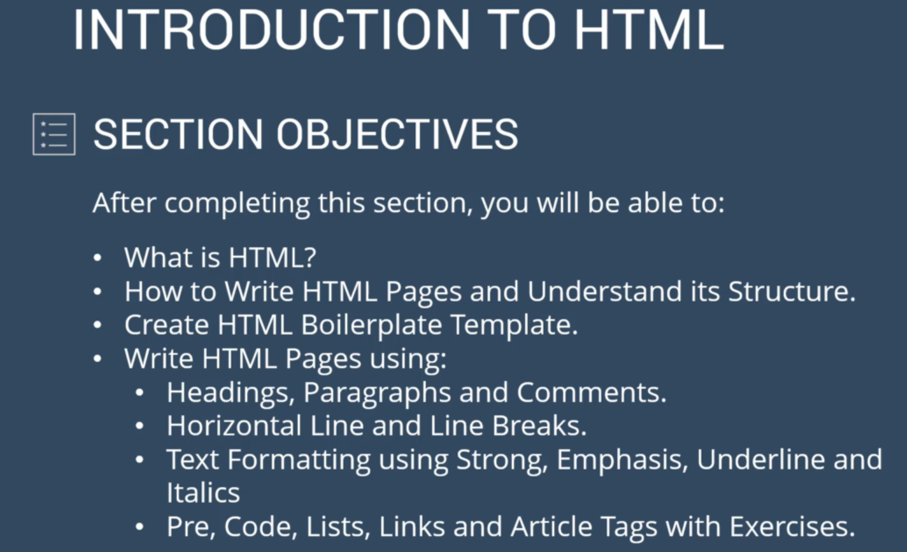
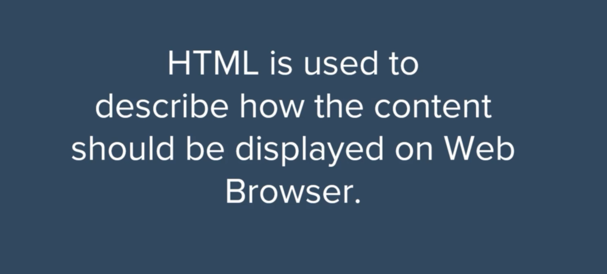
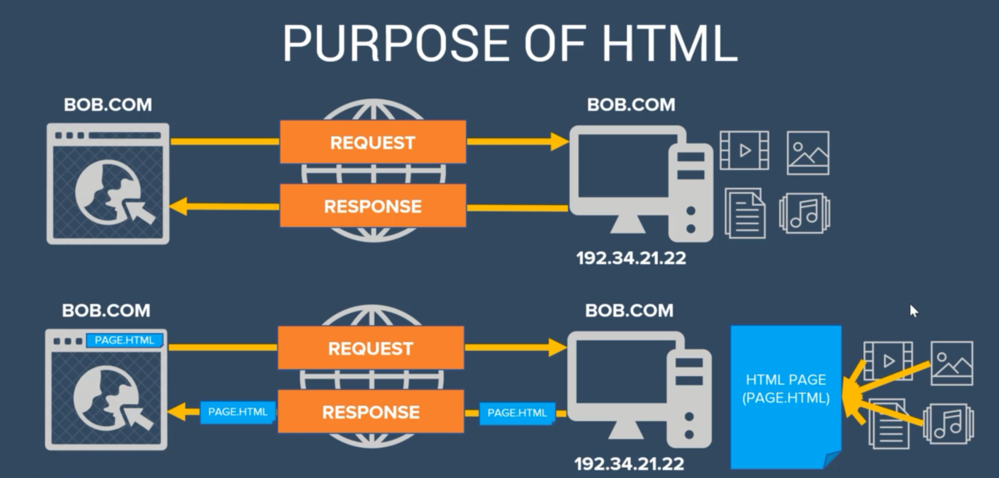
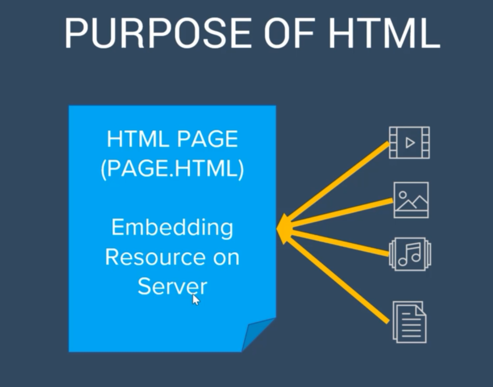
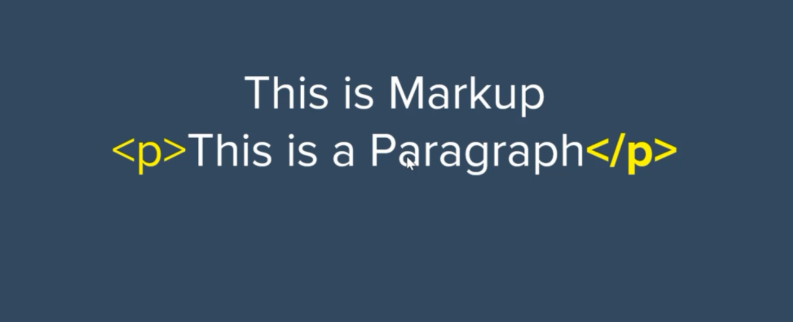
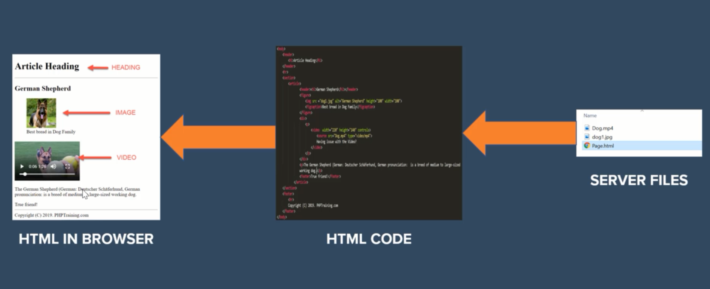
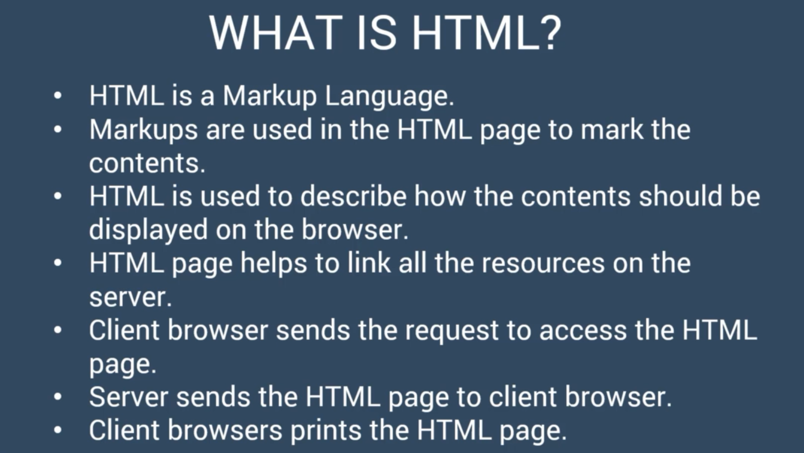

# Introduction To HTML

## Objective What you'll learn in this Section

## What is HTML

## Tag, Element and Attribute

## Structure of HTML Page

## My First HTML Page
## 7. HTML Boilerplate
## 8. Header Tags
## 10. Paragraphs and Comments 
## 12. Horizontal Lines and Line Breaks
## 14. Strong, Emphasis, Underline and Italics
## 16. Pre and Code Tags
## 18. Definitions, Ordered and UnOrdered Lists
## 20. Link Tags
## 22. Section and Article Tags
## 24. Additional HTML Tags
## 25. NewsPaper Exercise
## 28. Things to Remember
## 29. Summary What you have learned in this Section
## 
## 
## 

 